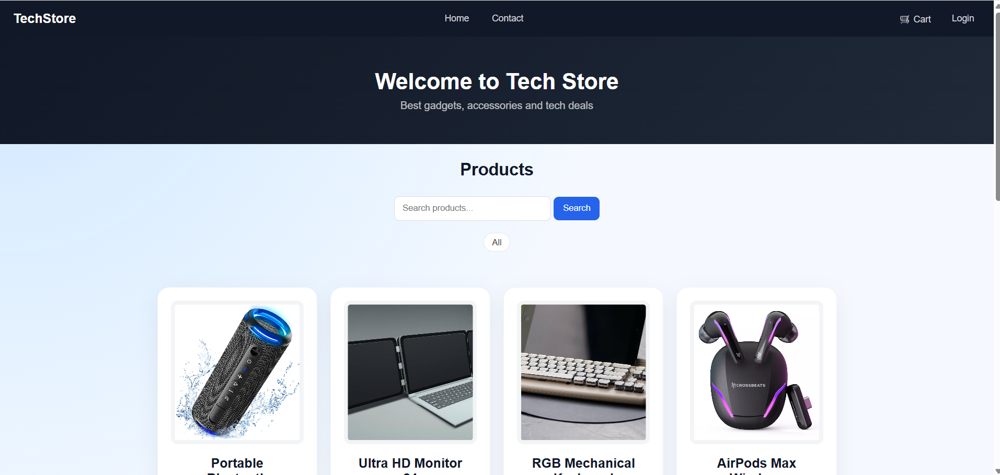
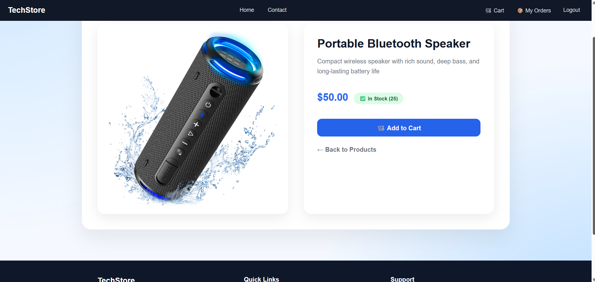
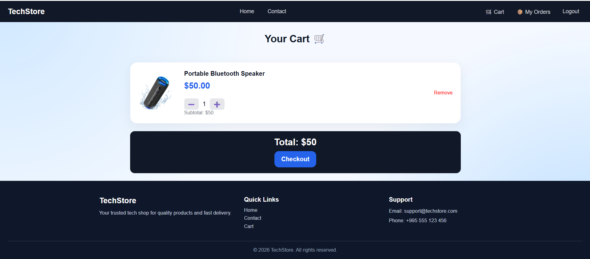
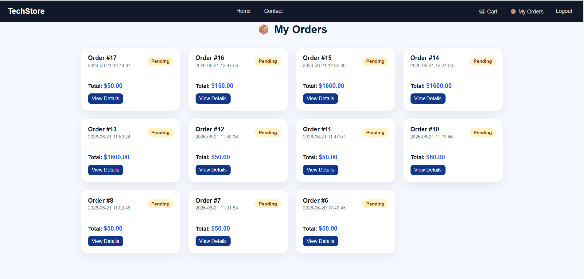

# 🛒 TechStore

TechStore is a simple e-commerce web application that I built using PHP and MySQL. The project allows users to browse products, add items to their cart, place orders, and view their order history. It also includes an admin dashboard for managing products and customer orders.

## 🚀 Features

* Browse products
* View product details
* Add items to cart
* Place orders
* View order history
* User authentication
* Admin dashboard
* Product management
* Order management

## 🧱 Tech Stack

* PHP
* MySQL
* HTML5
* CSS3
* JavaScript

  

## 📸 Screenshots

### 🏠 Home Page

### 📄 Product Page

### 🛒 Checkout

### 📦 My Orders

### 🧑‍💼 Admin Dashboard

## 👨‍💻 Author

Portfolio project built with PHP and MySQL.
